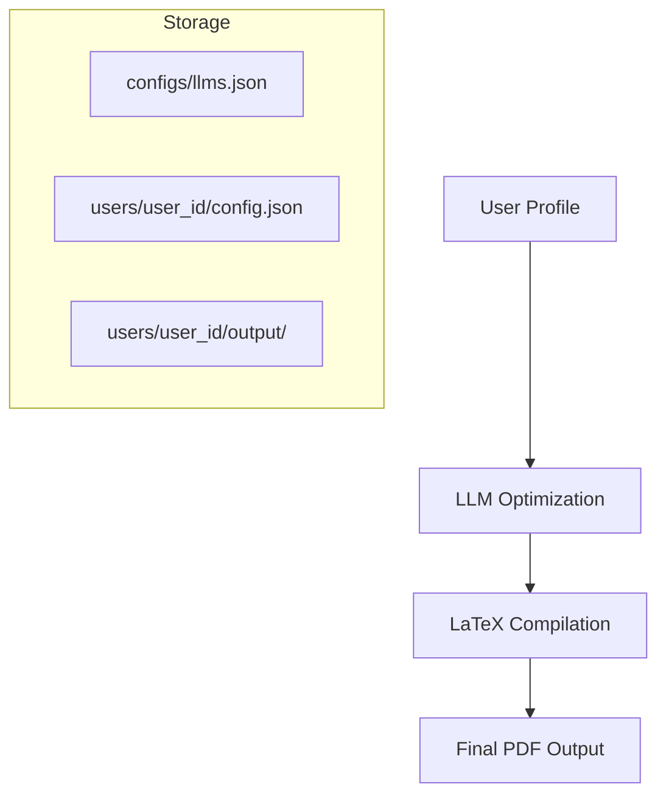

# <p align="center">🚀 ATS Resume Optimizer & Tailor Agent</p>

<p align="center">
  
  
  
  
  
</p>

---

<p align="center">
  <b>The Ultimate AI-Powered Career Assistant</b><br>
  <i>Tailor your resume to any job description in seconds using State-of-the-Art LLMs.</i><br><br>
  <a href="#-key-features">Features</a> • 
  <a href="#-tech-stack">Tech Stack</a> • 
  <a href="#-quick-start">Quick Start</a> • 
  <a href="#-architecture">Architecture</a>
</p>

---

## 🌟 Overview

**ATS Resume Optimizer** is a next-generation agentic application that transforms your generic resume into a **highly tailored, ATS-compliant PDF** targeting a specific job description. 

Built with **Streamlit** and **LangChain**, it leverages powerful models like **Google Gemini Pro** and **GPT-4o** to re-write content, optimize keywords, and generate professional LaTeX documents automatically.

---

## ✨ Key Features

| 🧠 **Intelligent Optimization** | 🎨 **Premium Experience** | 🛠️ **Total Control** |
| :--- | :--- | :--- |
| **Multi-Model Support**: Use Gemini, GPT-4o, Claude, and more. | **Glassmorphism UI**: Modern, focused, and intuitive dashboard. | **Prompt Engineering**: Edit system prompts directly from the UI. |
| **Context-Aware Rewriting**: AI highlights the *right* skills for each JD. | **Multi-User Workspace**: Private logins for profiles and templates. | **Model Inventory**: Manage your own API keys and provider list. |
| **ATS Scoring**: Get instant feedback on your resume's match percentage. | **History Tracking**: Access all past generations in one central place. | **Template Management**: Upload and manage custom LaTeX templates. |

---

## 💻 Tech Stack

### Frameworks & Libraries
<p>
  
  
  
  
</p>

### AI & LLM Providers
<p>
  
  
  
</p>

---

## 🚀 Quick Start

### 1. Installation

```bash
git clone https://github.com/bhuvanthirwani/ATS.git
cd ATS
pip install -r requirements.txt
```

### 2. Run the App

```bash
streamlit run app.py
```

### 3. Login
Enter any unique **User ID** (e.g., `jdoe`) to create your private workspace.

### 3. Login
Enter any unique **User ID** (e.g., `jdoe`) to create your private workspace.

---

## 🚢 Deployment (Production)

This project includes automated scripts for deploying to an Ubuntu server (e.g., Oracle Cloud, DigitalOcean) with Docker and Nginx (SSL).

### 1. Initial Server Setup
Run this once to install Docker, Nginx, and configure the Firewall.
```bash
sudo ./setup.sh
```

### 2. Run Application
Use the manager script to build and start the Docker container.
```bash
./docker_manager.sh
# Select Option 2: Run Container
```

### 3. Configure SSL & Domain
Map your domain (e.g., `ats.haxcodes.dev`) and auto-configure SSL with Certbot.
```bash
sudo ./nginx.sh
```

---

## 📸 Architecture

### Data Flow & Persistence
All user data is stored locally for privacy and portability:



---

## 👤 Author

**Bhuvan Thirwani**  
*Full Stack AI Developer*

---

<div align="center">
    <h3>Ready to land your dream job?</h3>
    <p><i>Start optimizing today.</i></p>
</div>
